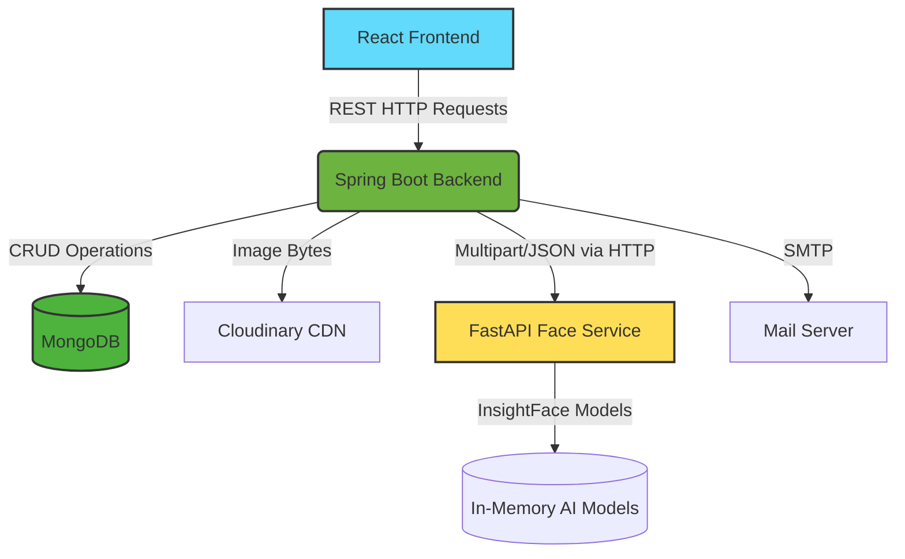
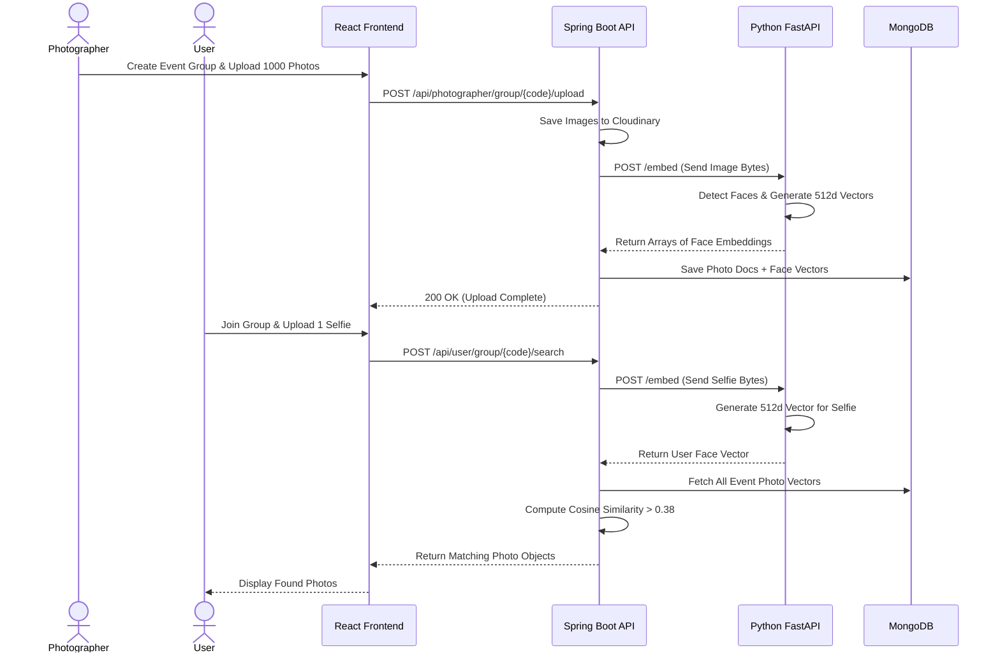

# Metapic (Metapic) — Comprehensive Project Overview

## 🧐 What This Project Does
Metapic is a smart photo-sharing platform designed for events (weddings, parties, corporate gatherings). When a photographer shoots an event, they often take thousands of photos. Attendees usually struggle to find the few photos they are actually in. 

This project solves that problem using **AI Face Recognition**.
1. The **Photographer** creates an event group and bulk-uploads all event photos.
2. An **Attendee (User)** joins the group via a 6-digit code.
3. The User uploads a single "Selfie".
4. The system's AI instantly scans all thousands of event photos and returns only the photos where the User's face is detected.

---

## ⚙️ How It Works (In Simple Words)
- When a photographer uploads a photo, the backend sends the image to Cloudinary for storage, and then sends the image bytes to a Python AI service (`face-service`).
- The Python service uses **InsightFace** (a state-of-the-art face recognition library) to detect every face in the photo and convert each face into a "vector" (a list of 512 numbers representing facial features). These vectors are saved in MongoDB.
- When a user uploads their selfie, the backend sends the selfie to the Python service to get *their* 512-number vector.
- The Java backend then compares the User's vector against all the vectors saved in the database using **Cosine Similarity** (a mathematical way to measure how close two sets of numbers are). If the similarity score is high enough (e.g., > 0.38), it's a match!

---

## 🖼️ Technical Architecture & Flow Diagrams

### System Architecture



### Project Workflow



---

## 🏗️ Tech Stack & Requirements

### Tech Stack
- **Frontend**: React.js (Vite/CRA), Axios
- **Core Backend**: Java 21, Spring Boot 3.4.3
- **AI Microservice**: Python, FastAPI, InsightFace (onnxruntime)
- **Database**: MongoDB (Spring Data MongoDB)
- **Storage**: Cloudinary
- **Authentication**: JWT (JSON Web Tokens), BCrypt Password Hashing
- **Email**: JavaMailSender (SMTP via Mailtrap/Sendgrid)

### Prerequisites
- **Java 21** installed (`java -version`)
- **Maven** installed (`mvn -v`)
- **Python 3.10+** (for the face service)
- **MongoDB** running locally (port 27017) or via MongoDB Atlas
- **Cloudinary Account** (API Key, Secret, Cloud Name)

---

## 🗄️ Database Design (MongoDB Collections)

1. **`users`**
   - `_id`: ObjectId
   - `name`: String (Unique)
   - `email`: String
   - `password`: String (BCrypt hash)
   - `selfieUrl`: String
   - `joinedGroups`: List of Strings (Group IDs)
   - `resetOtp`: String (Forgot Password)
   - `resetOtpExpiry`: Date

2. **`photographers`**
   - `_id`: ObjectId
   - `name`, `businessName`, `email`, `passwordHash`, `avatarUrl`
   - `groups`: List of Strings (Group IDs)

3. **`groups`**
   - `_id`: ObjectId
   - `name`: String
   - `code`: String (Unique 6-digit join code)
   - `photographer`: String (Photographer ID)
   - `photos`: List of Strings (Photo IDs)
   - `participants`: List of Strings (User IDs)

4. **`photos`**
   - `_id`: ObjectId
   - `url`, `publicId` (Cloudinary references)
   - `group`: String (Group ID)
   - `embeddings`: `List<List<Double>>` (Array of 512-float arrays representing faces)

---

## 🌐 Endpoints

| Method | Route | Auth Required | Description |
|---|---|---|---|
| POST | `/api/signup` | Public | Register new user |
| POST | `/api/login` | Public | Login user, return JWT |
| POST | `/api/forgot-password` | Public | Send reset OTP to User email |
| POST | `/api/reset-password` | Public | Reset User password with OTP |
| POST | `/api/photographer/signup` | Public | Register new photographer |
| POST | `/api/photographer/login` | Public | Login photographer, return JWT |
| POST | `/api/client/join-group` | User JWT | Join event via 6-digit code |
| GET  | `/api/user/my-groups` | User JWT | List groups user has joined |
| POST | `/api/user/group/{code}/search` | User JWT | Match user selfie against event photos |
| POST | `/api/user/upload-avatar` | User JWT | Upload user profile picture |
| GET  | `/api/photographer/my-groups` | Photog JWT | List photographer's managed groups |
| POST | `/api/photographer/create-group` | Photog JWT | Create new event, generates 6-digit code |
| GET  | `/api/photographer/group/{code}` | Photog JWT | View group details and all photos |
| POST | `/api/photographer/group/{code}/upload` | Photog JWT | Bulk upload photos, triggers AI embedding |
| POST | `/api/photographer/group/{code}/delete-photos` | Photog JWT | Delete specific or all photos in a group |
| DELETE| `/api/photographer/group/{code}` | Photog JWT | Delete entire group and cascade delete photos |

---

## 📁 Folder Structure

```text
Metapic-main/
├── frontend/                 # React Application
├── face-service/             # Python FastAPI Microservice
│   ├── app/main.py
│   └── requirements.txt
└── backend-java/             # Spring Boot Core API
    ├── src/main/java/com/metapic/
    │   ├── config/           # Security, CORS
    │   ├── controller/       # API Route definitions
    │   ├── dto/              # Request/Response payloads
    │   ├── filter/           # Rate limiting
    │   ├── model/            # MongoDB Entity classes
    │   ├── repository/       # Database access layers
    │   └── service/          # Business logic, JWT, FaceClient, Email
    ├── src/main/resources/
    │   └── application.properties # Spring config
    ├── .env                  # Environment Variables
    └── pom.xml               # Maven Dependencies
```

---

## 🚀 How To Run It

To run the full stack locally, you need three terminal windows:

**1. Database & AI Service (Terminal 1)**
Make sure MongoDB is running locally. Then start the face service:
```bash
cd face-service
python -m venv venv
source venv/Scripts/activate   # (Windows)
pip install -r requirements.txt
uvicorn app.main:app --host 0.0.0.0 --port 8000
```

**2. Java Backend (Terminal 2)**
```bash
cd backend-java
# Edit .env file with your Cloudinary keys first!
mvn spring-boot:run
```
*(The backend will start on http://localhost:4000)*

**3. React Frontend (Terminal 3)**
```bash
cd frontend
npm install
npm run dev
```

---

## ⚠️ Limitations & Future Improvements

### Current Limitations
1. **Synchronous Uploads:** When a photographer uploads 100 photos, the API waits for Cloudinary AND the Face Service to process all 100 before returning a response. This can cause HTTP timeouts for very large batches.
2. **In-Memory Rate Limiting:** The `RateLimitFilter` uses an in-memory `ConcurrentHashMap`. If the backend is horizontally scaled (running on multiple servers), rate limits will not be shared across servers.
3. **Storage Costs:** Cloudinary is used to store raw, high-resolution event photos, which can get extremely expensive at scale.

### Future Improvements
1. **Asynchronous Processing (Message Queue):** Use RabbitMQ or Kafka. The upload endpoint should quickly save the images to AWS S3, place an "extract_faces" job on a queue, and return immediately. The Face Service can then pull from the queue in the background.
2. **Redis Caching & Rate Limiting:** Move the Rate Limiting bucket to Redis so it works across multiple servers. Cache frequently accessed group details in Redis.
3. **AWS S3 / Signed URLs:** Migrate away from Cloudinary for primary storage. Store files cheaply on AWS S3 and generate temporary Signed URLs for the frontend to view them securely.

---

## 🎤 Technical Interview Questions

If you present this project in an interview, prepare for these questions:

**Q1: Why did you separate the Face AI into a Python microservice instead of doing it in Java?**
*Answer:* "Python is the undisputed leader for AI and Machine Learning ecosystems. Libraries like InsightFace and OnnxRuntime are native and highly optimized in Python. Java is excellent for robust business logic, REST APIs, and database transactions. Using a microservice architecture allowed me to use the best tool for each specific job."

**Q2: How does the face matching algorithm actually work?**
*Answer:* "The AI model (InsightFace) maps facial features onto a 512-dimensional vector space. When comparing a selfie vector to a group photo vector, the system calculates the **Cosine Similarity** between the two arrays. Cosine similarity measures the angle between two vectors—if the angle is very small (score closer to 1.0), it means the vectors point in the exact same direction, indicating the faces belong to the same person."

**Q3: Spring Data MongoDB doesn't support Mongoose's `.populate()`. How did you handle relational joins in a NoSQL database?**
*Answer:* "Since MongoDB doesn't do native SQL joins, I implemented manual population in the service layer. For example, to load a Group and its Participants, I first query the `Group` collection to get the array of participant IDs. I then make a second, highly-indexed `findAllById(participantsList)` query to the `User` collection, and stitch the data together in Java before returning the JSON payload."

**Q4: What happens if two photographers upload photos at the exact same time? Will the AI service crash?**
*Answer:* "FastAPI is asynchronous, but heavy CPU-bound tasks like AI inference can block the event loop. To handle high concurrency, the Python service would need to be run with multiple Uvicorn workers, or ideally, the heavy lifting should be moved to a task queue (like Celery or RabbitMQ) so the API doesn't get blocked."

**Q5: How is authentication handled securely?**
*Answer:* "Authentication is stateless using JSON Web Tokens (JWT). When a user logs in, their password is verified against a BCrypt hash. A JWT is issued containing their `_id` and signed with an HMAC SHA-256 algorithm. The frontend sends this token in the `Authorization: Bearer` header on subsequent requests. The Java backend decodes the token, extracts the `_id`, verifies the signature using a secret key, and resolves the user entity for the controller."

**Q6: How did you prevent Brute Force attacks on the login or OTP endpoints?**
*Answer:* "I implemented a `RateLimitFilter` at the servlet level, before Spring Security even processes the request. It uses a fixed-window token bucket algorithm tracking client IP addresses, strictly limiting traffic to 120 requests per minute to mitigate abuse and brute-forcing."
